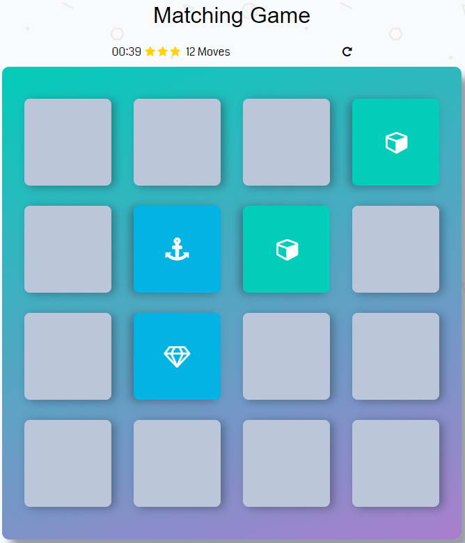

# Memory Game Project

## Table of Contents

* [What is...](#what is The Memory Game)
* [How to...](#how to play)
* [Gamepaly](#gameplay)
* [Challenge](#challenge)

## What is the Memory Game

It is an easy game where you can test your memory.

## How to Play

You can reach the game here: https://schwaott.github.io/fend-project-memory-game/

## Gameplay

Take it in turn to pick two cards. If the cards have the same figur (two cube, for example), the cards keep face-up position and are out of the game. If not, the cards are returned to their face-down position and the game continues. Play until all the cards have been matched.

## Challenge

Try to pair with the fewest possible steps in the minimum time.
